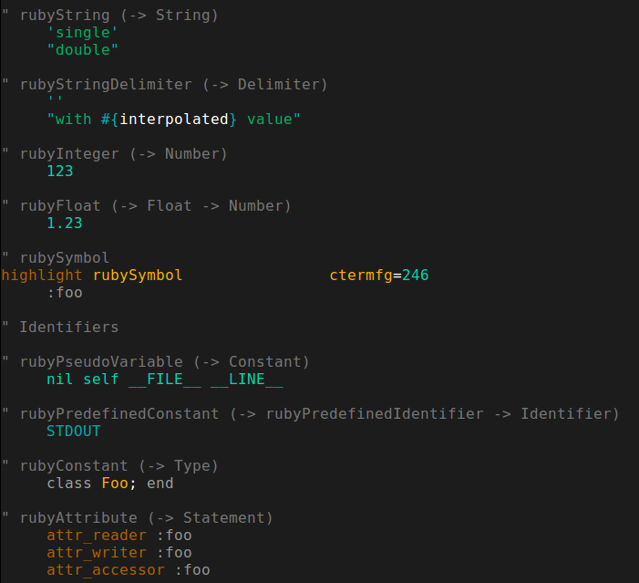

# vim-jgy-256-theme

A Vim colour scheme for 256-colour terminals

# Code snippets in the colorscheme file

The colorscheme definition file `colors/jgy-256.vim` contains snippets of code
from various languages, indicating how the colours come out.

